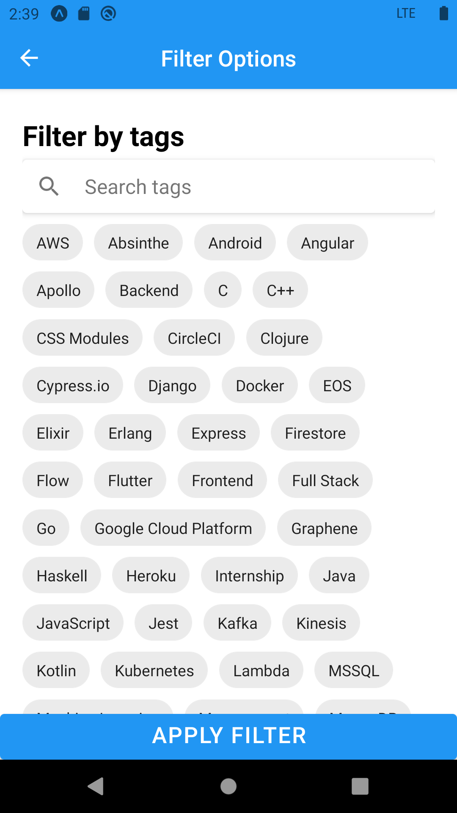
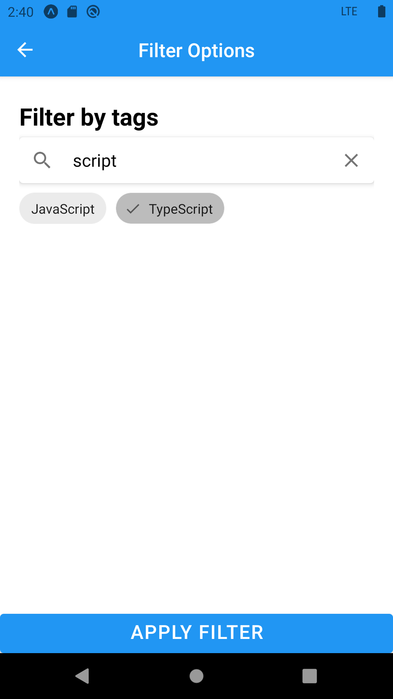
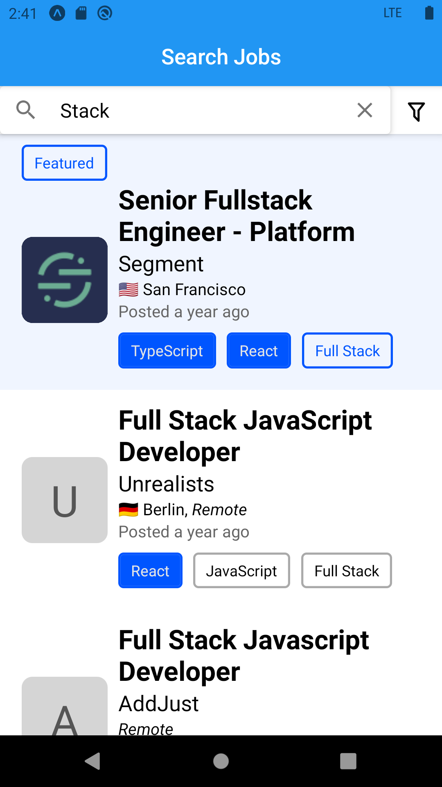

# Job Search Engine

This application is built with React Native Expo and integrating with
additional libraries, such as React Native Paper, React Native Markdown
Display, and Mobx State Tree. The search application consumes GraphQL from
https://graphql.jobs/ and provides additional searching and filters.

# Technologies Involved

- [React Native](https://reactnative.dev/)
- [Expo](https://expo.io/)
- [Mobx State Tree](https://mobx-state-tree.js.org/)
- [React Native Paper](https://reactnativepaper.com/)
- [React Native Markdown Display](https://github.com/iamacup/react-native-markdown-display)
- [Logos API provided by Clearbit](https://clearbit.com)

# Installation

To install: ``npm i``

To run: ``expo start``

To publish: ``expo publish``

# Preview

## Search Page

## Filter Page

Filter Options|Search Tags
:-:|:-:
 | 

## Filtered Search Result

## Search Job Title

## Job Description Page
